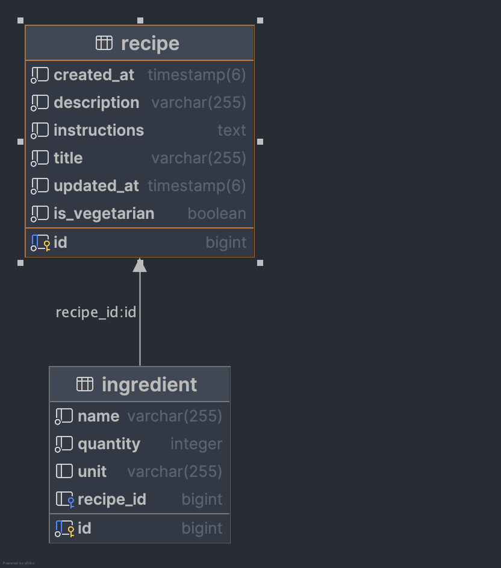
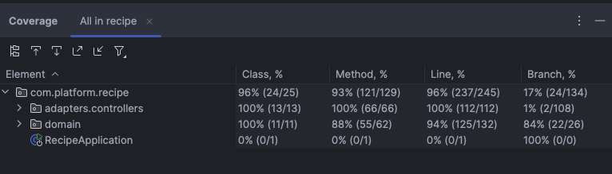

# 🍽️ Recipe API

A RESTful API built with Java Spring Boot for managing cooking recipes. This project allows users to create, search, update, and delete recipes while supporting flexible filters and structured data handling.

## 🧠 Project Overview
The API allows users to:

* Create, update, list, and delete recipes.
* Search recipes using:

    * Included or excluded ingredients.
    * Instruction content.
    * Vegetarian filter.
    * Creation date range.

---

## ⚙️ Getting Started

### Requirements

* Java 17
* Spring Boot 3.5.0
* PostgreSQL 14.17
* Maven (or an IDE with Maven support)

### Running Locally

1. Clone the repository:

   ```bash
   git clone https://github.com/zeguilherme99/recipe.git
   cd recipe
   ```

2. Set up PostgreSQL with the following credentials:

   Ensure PostgreSQL 14.17 is running and available.

    Edit `src/main/resources/application.yaml` with your local database credentials:
    
    ```yaml
    spring:
      datasource:
        url: jdbc:postgresql://localhost:5432/recipe
        username: postgres
        password: yourpassword
    ```

3. Run the application:

   ```bash
   ./mvnw spring-boot:run
   ```

4. Access Swagger/OpenAPI docs:

   Visit: [http://localhost:8080/documentation.html](http://localhost:8080/documentation.html)

---

## 📉 Project Structure

### 🧠 Architecture and Design Choices

This project follows a **Domain-Driven Design (DDD)** approach, separating responsibilities into well-defined layers and packages. The main design goals are clarity, testability, and maintainability.

#### 📦 Package Structure

- `domain.entities` – Contains core business models like `Recipe` and `Ingredient`.
- `domain.repositories` – Defines repository interfaces for querying and persistence.
- `repositories.implementations` – Implements custom queries (e.g., dynamic filtering with `CriteriaBuilder`).
- `services` – Encapsulates business logic and orchestrates entity operations.
- `controllers` – Exposes REST endpoints to interact with the system.
- `dto` & `responses` – Used to decouple internal models from external representations.

#### 🧱 Design Patterns and Principles

- **Domain-Driven Design (DDD)**: The core domain logic is placed at the center of the application.
- **Hexagonal Architecture (Ports and Adapters)**: While not fully formalized, the project loosely follows this style by decoupling business logic from infrastructure and external interfaces.
- **DTO Mapping**: Recipes and ingredients are converted to DTOs and response models to avoid exposing internal entities.
- **Validation**: Javax/Jakarta annotations are used for input validation.
- **Testing**: Integration tests use **H2** in-memory database with Spring's `@DataJpaTest`.

### 🫠 Design Decisions

* Why a Separate `Ingredient` Entity?

  * **Normalization & Scalability**: Ingredients have `name`, `quantity`, and `unit`, not just text.
  * **Query Flexibility**: Enables **`include`** and **`exclude`** search logic.
  * **Clean Domain Modeling**: Reflects real-world structure more accurately.
  * **SRP Compliant**: Responsibilities are split between Recipe and Ingredient.
    
#### 💪 Testing with H2 and Custom Repository

* In-memory testing with **H2**
* Custom repository implementation: `CustomRecipeJpaRepositoryImpl`
* Queries validated using static data and timestamps

#### 📃 DTO Layer and Mappers

* Avoids exposing internal entities
* Clear boundaries between layers
* Easier refactoring and response shaping

#### 🔍 Dynamic Filtering with Criteria API

* Composable filters with **JPA Criteria API**
* Optional params like `createdAfter`, `include`, etc.
* Clean and testable implementation

#### 🖌️ API Error Modeling

* Structured `ResponseError` and `FieldError` classes
* Integrated with OpenAPI for clear contract documentation
---

## 🔮 Testing

* Integration tests using H2.
* Covered use cases:

    * Persisting recipes.
    * Search filters (ingredients, instructions, dates).
    * Include/Exclude ingredients logic.
* Coverage
  

---
##  🧩 Future Improvements

* Create database indexes
* Ingredients CRUD endpoints
* Search by recipe name

---

## 💌 Contact

**José Guilherme**
💼 [LinkedIn](https://www.linkedin.com/in/jose-guilherme-dias/)
